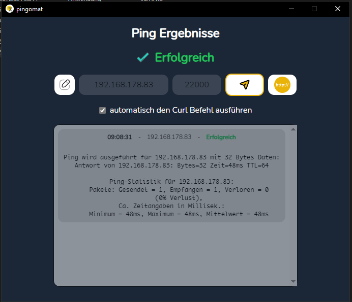
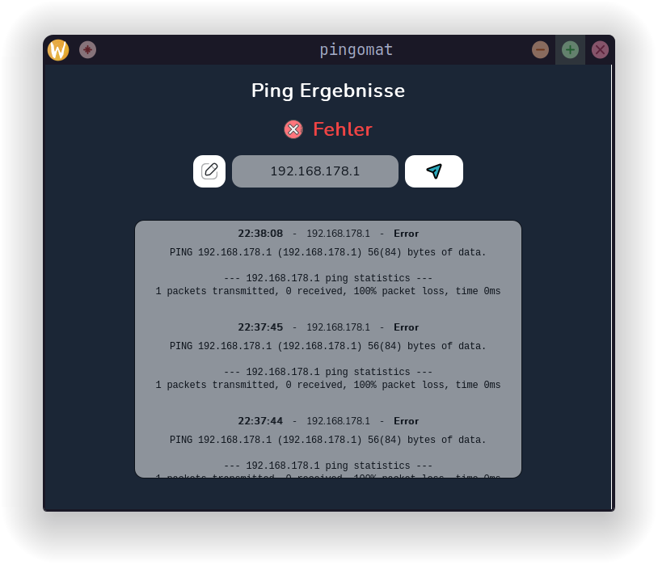
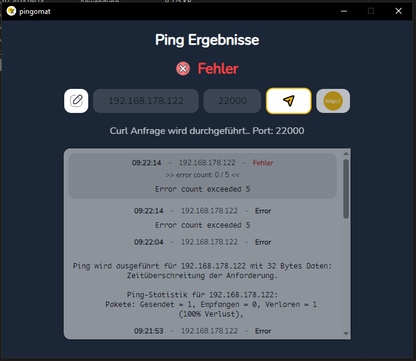

# pingomat



## About

Version: 2.0.1

This is a quick and dirty desktop program for pinging a local ip adress on the default port. On error you will get a desktop notification and a flashing window bar icon.
This might be useful if you need to be notified as soon as your device is not available anymore or to keep it alive.

## Feature Log

### v2
Since I was able to ping my device again after sending a random curl request, I added the option to send a curl request to the given ip address and port.
You also have the option to send an automatic curl request after 5 failed ping attempts.

## Technologies

- [wails](https://wails.io/)
- [golang](https://go.dev/)
- [typescript](https://www.typescriptlang.org/)
- [react](https://react.dev/)
- [tailwindcss](https://tailwindcss.com/)

### Further Dependencies

- [beeep](https://github.com/gen2brain/beeep)
- [vite](https://vitejs.dev/)

## Building

To build a redistributable, production mode package, use 
```sh
wails build
```

## License

[MIT License](LICENSE)

## Screenshots


